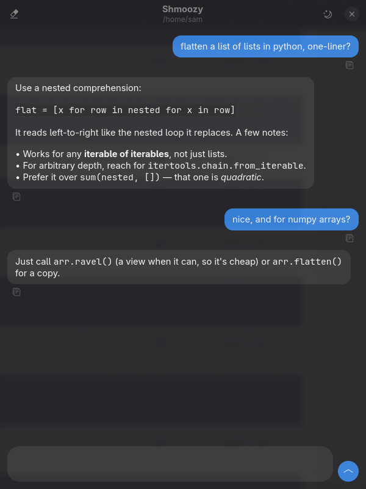

# Shmoozy &nbsp;

A dead-simple **native chat app for [Claude Code](https://claude.com/claude-code) on Arch / Linux**.
It's a thin GTK4 + libadwaita front-end over the `claude` CLI — your messages
stream back token-by-token, conversations keep their context, and replies render
as markdown.

No API key to manage: Shmoozy drives the `claude` binary you already have
installed, so it uses your existing Claude Code auth. It's the Linux counterpart
to [Chatty](https://github.com/lubabs770/chatty) (the native macOS app).

<p align="center"></p>

## Features

- **Streaming responses** — text appears token-by-token via `claude --output-format stream-json`.
- **Multi-turn memory** — captures the `session_id` and passes `--resume`, so it's a real conversation, not one-shots.
- **Markdown rendering** — headings, lists, bold/italic, inline + fenced code, blockquotes, links.
- **Copy any message** — a light-grey copy button under every bubble puts its text (markdown source for replies) on the clipboard.
- **Light / dark / OLED** — the header button cycles all three; OLED is pure black for AMOLED screens. Remembered across launches.
- **Tools work** — web search, file reads, bash, etc. run in a configurable working directory.
- **Client auto-detect** — injects a `client: shmoozy` marker into Claude's system prompt, so your `CLAUDE.md` can flip Claude into "just chat" mode when you're in the app.
- **New-conversation button** — clears history and starts a fresh session.

## Install

```sh
sudo pacman -S --needed python-gobject gtk4 libadwaita   # runtime deps
./install.sh                                             # per-user, no root
```

Then launch **Shmoozy** from your app launcher, or just run `shmoozy`.
To try it without installing: `python3 shmoozy.py`.

### Requirements

- Arch (or any Linux) with **GTK 4**, **libadwaita**, and **PyGObject** (`python-gobject`).
- The **Claude Code CLI** (`claude`) on your `PATH`, already authenticated.
- Wayland or X11 — it's a normal GTK4 app.

## Keys

- **Enter** — send. **Shift+Enter** — newline.

## Configuration

Edit the constants at the top of `shmoozy.py`:

- `WORKING_DIRECTORY` — the folder `claude` runs in (what it can see/touch). Defaults to `$HOME`.
- `PERMISSION_MODE` — how tool-use is handled (see the warning below).
- `CLIENT_MARKER` — the system-prompt marker for `CLAUDE.md` auto-detection.

Theme preference is stored in `~/.config/shmoozy/config.json`.

> [!WARNING]
> **Security note:** `PERMISSION_MODE = "bypassPermissions"` (the default) lets
> Claude run tools — including **bash and file edits** — inside
> `WORKING_DIRECTORY` with **no confirmation prompt**. There's no interactive
> approval in this UI, so anything stricter auto-denies tool calls mid-turn.
> Point `WORKING_DIRECTORY` at a scratch folder, or set `PERMISSION_MODE` to
> `"default"` for conversation-only.

## How it works

Each turn spawns:

```
claude -p <prompt> \
  --output-format stream-json --include-partial-messages --verbose \
  --permission-mode bypassPermissions \
  --append-system-prompt "client: shmoozy" \
  [--resume <session_id>]
```

It reads the JSONL stream off the pipe on the GLib main loop, pulls
`session_id` (for `--resume`) and `text_delta` chunks (for live text), and
renders them into libadwaita chat bubbles.
